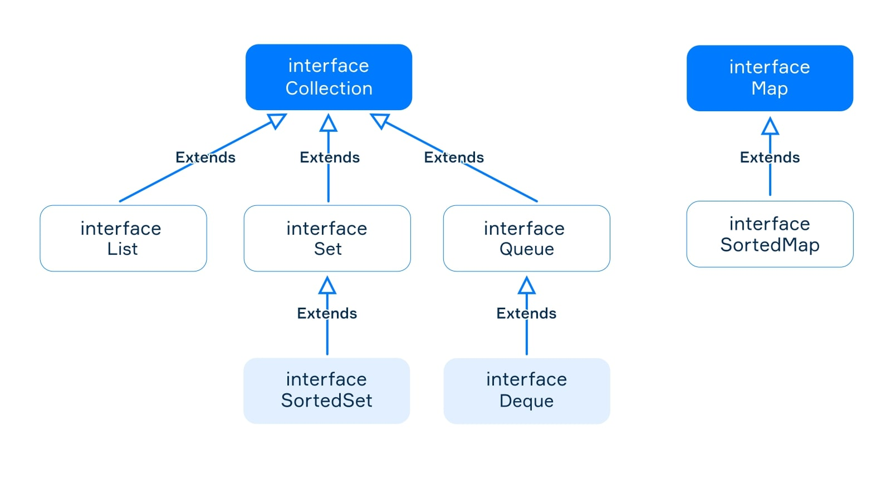

# The collections framework

- consists of classes and interfaces for commonly reusable data structures such as lists, dynamic arrays, sets and so on.

## Relationship

## The Collection interface

- Here are common methods provided by the Collection interface.

  - `int size()` returns the number of elements in this collection;
  - `boolean isEmpty()` returns true if this collection contains no elements;
  - `boolean contains(Object o)` returns true if this collection contains the specified element;
  - `boolean add(E e)` adds an element to the collection. Returns true, if the element was added, else returns false;
  - `boolean remove(Object o)` removes a single instance of the specified element;
  - `boolean removeAll(Collection<?> collection)` removes elements from this collection that are also contained in the specified collection;
  - `void clear()` removes all elements from this collection.
