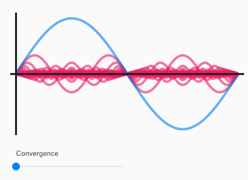
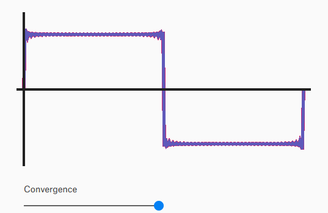
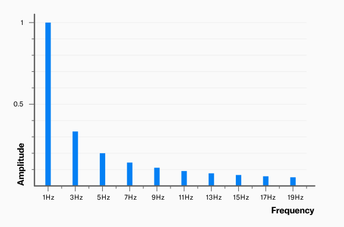

# Waveform basics

[Source](https://pudding.cool/2018/02/waveforms/)

- **Fundamental Frequency** (基本周波数) - 1Hz frequency

- **Harmonics** (高調波 ?)

  When a wave has "side effects" (unlike sine waves), we call them harmonic. They are additional frequencies that are created by certain waveforms.
  Harmonics are always a multiple of source frequency.

- **Different types of waveforms**

  - Triangle waveform
  - Square waveform
  - Sawtooth waveform

    - In terms of harmonics, sawtooth waveforms have additional frequencies at every multiple of the source(root) frequency, unlike triangles and squares which only have odd harmonics.

- **Additive Synthesis**

  Every waveform of any shape can be built by just layering different sine waves.

  - **Generating square wave from sine waves**

    - Before combining
    
      
    - After combining
    
      
    - Components of a square wave
    
      

